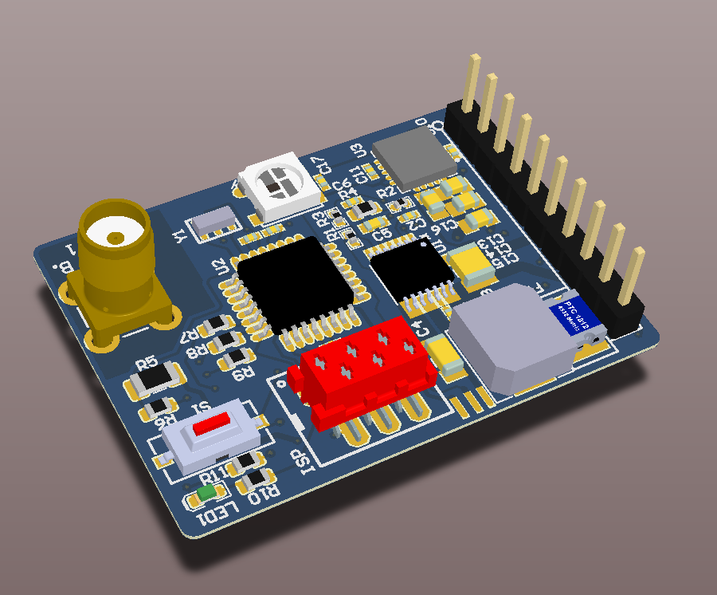

# miniTX5823
The miniTX5823 is a video and audio transmitter module designed for fpv. The Software ist compatible to [tx5823-pro](https://github.com/sheaivey/tx5823-pro).

## Hardware
The module contains the popular TX5823 video transmitter, modded so that channel selction via SPI ist possible. In addition there is a 5V buckconverter on the board with up to 2A output current, allowing 3s and 4s input. For clean voltage the TX5823 has its own, ultra low noise linear regulator.

Above all there is a IR transistor and a button on the module which makes easy binding with your receiver possible. You select the channel at your receiver in manual mode an bring it next to your transmitter. By pushing the button the transmitter changes to the channel of the receiver. The [rx5808-pro-diversity](https://github.com/sheaivey/rx5808-pro-diversity/) or other compatible receivers have the necessary IR diode to use this feature.

Dimensions are 4cm x 3cm

## Software
For the beginning the board will run [tx5823-pro](https://github.com/sheaivey/tx5823-pro).
For future it is planned to add support for the onboard WS2812B RGB led
